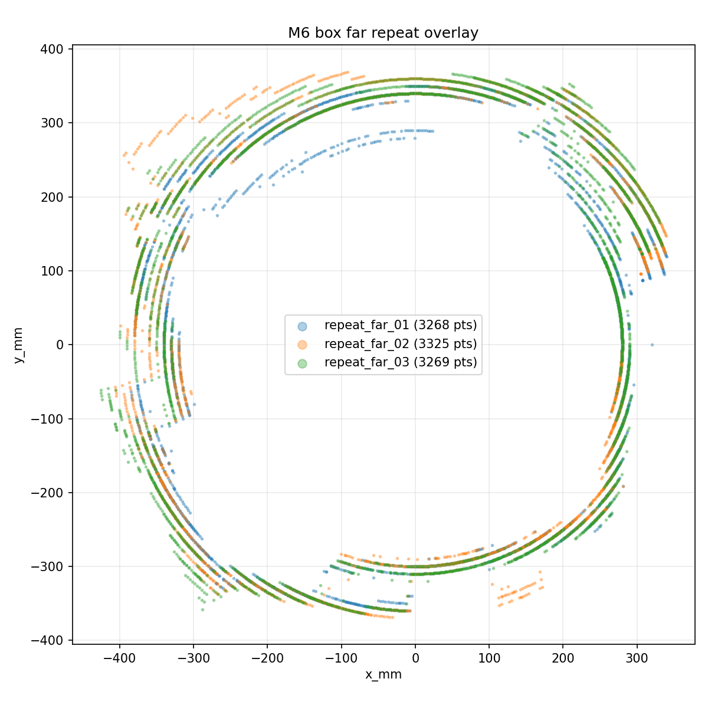

# LADAR2：STM32F407 旋转式 2D LiDAR

这是一个嵌入式项目：用 STM32F407 + FreeRTOS 把 TF-Luna 距离数据与编码器角度、采样时间配对，经 CAN 发送到 Linux/Windows 上位机，完成点云重组、CSV 记录、回放与几何质量分析。

## 面试官先看这里

- **解决的问题：** 把“能读到距离”扩展成一条可解释、可诊断、可回放的 2D 感知链路。
- **核心工程工作：** UART DMA/IDLE 流解析、角度/时间回推、电机闭环与换向、CAN 双帧协议、上位机重组和验证工具链。
- **证据边界：** 代码、自检、实板记录和未覆盖项分别说明，不把离线测试等同于全部硬件场景。

| 可核查结果 | 当前证据 |
| --- | --- |
| 端到端链路 | TF-Luna → MCU → CAN → Host → CSV/点云回放已形成闭环 |
| 短长稳基线 | `6116.0 s`（约 1h42min）、`612466` 点、CAN 重组丢包率 `0.001143%` |
| 几何基线 | 墙面直线 RMSE `7.44 mm`；盒子重复性 p95 `20.00 mm`、闭合缝隙 `11.82 mm` |

<table>
  <tr>
    <td></td>
    <td></td>
  </tr>
  <tr>
    <td align="center">双向扫描速度闭环记录</td>
    <td align="center">三轮点云重复性叠加</td>
  </tr>
</table>

## 阅读路线

- **30 秒：** 看本节的目标、结果和两张实测派生图。
- **3 分钟：** 看[一页项目总览](docs/m7/02_project_overview_one_page.md)、[系统图](docs/m7/01_system_diagrams.md)和[面试讲解稿](docs/m7/03_interview_talk_track.md)。
- **继续深挖：** 从下面的源码入口进入 UART、解析器、电机控制、CAN 协议和 Host 重组实现，再核对长稳与几何证据。

## 主链路

```text
TF-Luna UART
-> STM32 USART2 DMA/IDLE
-> 解析与过滤
-> 时间/角度配对
-> CAN 0x123 + 0x124
-> 上位机双帧重组
-> CSV 存储
-> 回放与 2D 点云显示
```

## 核心工程工作

| 工程问题 | 设计与实现 | 源码 / 证据入口 |
| --- | --- | --- |
| UART 是连续字节流，帧可能跨 DMA chunk | Receive-to-Idle DMA 回调只搬运 chunk；解析任务保留跨块状态，按帧头、校验和与质量条件重同步 | [`Core/Src/main.c`](Core/Src/main.c)、[`Core/Src/freertos.c`](Core/Src/freertos.c)、[`Core/Src/luna.c`](Core/Src/luna.c)、[`tools/selfcheck_luna_firmware.py`](tools/selfcheck_luna_firmware.py) |
| 旋转扫描需要距离与角度对应 | 在接收时刻保存编码器快照与时间信息，结合电机状态回推采样点；速度闭环负责稳定与换向 | [`Core/Src/freertos.c`](Core/Src/freertos.c)、[`Core/Src/motor.c`](Core/Src/motor.c)、[`Core/Src/pid.c`](Core/Src/pid.c)、[M2 记录](docs/m2/README.md) |
| 标准 CAN 单帧装不下完整点 | 固定 `0x123 + 0x124` 双帧合同，Host 按 `seq` 重组并统计 timeout、覆盖与回绕 | [`Core/Src/can.c`](Core/Src/can.c)、[`can_parser.py`](can_parser.py)、[CAN 报文表](docs/spec_freeze/03_报文表.md) |
| 单次演示不足以说明稳定性 | 同一 CSV 契约支持实时、回放与离线分析；保存短长稳统计和几何基线 | [`can_recv4.py`](can_recv4.py)、[M5 长稳摘要](docs/m5/05_current_run_summary.md)、[M6 几何指标](docs/m6/runs/m6_manual/geometry_metrics.md) |

## 当前状态

| 阶段 | 状态 | 主要证据 |
| --- | --- | --- |
| M1 原始采集 | 已收口 | [`docs/m1/`](docs/m1/) |
| M2 电机与角度同步 | 非机械误差预算已收口；机械误差仍是边界 | [`docs/m2/`](docs/m2/) |
| M3 CAN 与诊断 | 第一阶段验收口径已收口 | [`docs/m3/`](docs/m3/)、[CAN 报文表](docs/spec_freeze/03_报文表.md) |
| M4 上位机闭环 | 已收口 | [`docs/m4/`](docs/m4/) |
| M5 长稳基线 | 接受短长稳基线，不宣称严格 4h 通过 | [`docs/m5/`](docs/m5/) |
| M6 几何质量 | 离线几何基线已完成 | [`docs/m6/`](docs/m6/) |
| M6.5 MQTT 插件 | 当前本地/上板 MQTT 范围已收口；云端和 ESP32 不在范围内 | [`docs/mqtt_plugin_refactor/`](docs/mqtt_plugin_refactor/) |
| M7 面试交付与 V1 封板 | 文档交付已准备 | [`docs/m7/`](docs/m7/) |
| M8 / M9 离线探索 | 数据集、离线分析和规则滤波附录；不属于 V1 实板验收主线 | [`docs/m8/`](docs/m8/)、[`docs/m9/`](docs/m9/) |

## 目录结构

| 路径 | 作用 |
| --- | --- |
| [`Core/`](Core/) | STM32 固件源码，基于 CubeMX 生成后扩展 |
| [`can_recv4.py`](can_recv4.py) | Linux 上位机主入口：实时接收、回放和 UI |
| [`can_recv4_windows.py`](can_recv4_windows.py) | Windows 上板入口，适配 candleLight/gs_usb |
| [`can_core.py`](can_core.py) | 上位机纯业务计算：XY 转换、状态汇总、告警状态 |
| [`can_input.py`](can_input.py) | 输入适配层：CSV 回放、实时 CAN、串口预留 stub |
| [`can_output.py`](can_output.py) | 输出适配层：CSV/log 输出 |
| [`can_mqtt.py`](can_mqtt.py) | MQTT 输出适配和命令/状态 topic 处理 |
| [`tools/`](tools/) | 自检、M5 长稳、M6 分析、MQTT 闭环脚本 |
| [`docs/spec_freeze/`](docs/spec_freeze/) | 字段、CAN 报文、时间戳语义冻结文档 |
| [`docs/m1/`](docs/m1/) 到 [`docs/m6/`](docs/m6/) | 各阶段证据与分析 |
| [`docs/mqtt_plugin_refactor/`](docs/mqtt_plugin_refactor/) | M6.5 MQTT 重构与验证记录 |
| [`docs/m7/`](docs/m7/) | V1 面试交付包 |

## 环境准备

安装 Python 依赖：

```powershell
py -3 -m pip install -r .\requirements.txt
```

Windows 上板使用 candleLight/gs_usb 时，需要保持雷达板和 CAN 适配器连接，并使用 `gs_usb` backend。Linux 实时 CAN 需要先在系统侧把 `can0` 拉起。

## 常用命令

Windows 回放 UI：

```powershell
py -3 .\can_recv4_windows.py --mode replay --input-csv .\docs\m4\data\can_distance_v2_sample.csv
```

Linux 回放 UI：

```bash
python3 can_recv4.py --mode replay --input-csv docs/m4/data/can_distance_v2_sample.csv
```

Linux 实时 CAN：

```bash
python3 can_recv4.py --mode live --channel can0
```

Windows 实时 CAN：

```powershell
py -3 .\can_recv4_windows.py --mode live --can-interface gs_usb --channel 0 --bitrate 500000
```

Windows 实时 CAN + MQTT：

```powershell
py -3 .\can_recv4_windows.py --mode live --can-interface gs_usb --channel 0 --bitrate 500000 --mqtt
```

运行完整自检（固件构建、上位机、合同、M8/M9 离线分析和 Luna 固件解析器 host harness）前，还需要 CMake、Ninja 与 `arm-none-eabi-gcc`。新 checkout 先生成 Debug 构建目录：

```powershell
cmake --preset Debug
powershell -ExecutionPolicy Bypass -File .\tools\selfcheck_all.ps1
```

重新生成 M6 几何分析：

```powershell
py -3 .\tools\m6_group_analysis.py --run-dir .\docs\m6\runs\m6_manual
py -3 .\tools\m6_tuning_scan.py --run-dir .\docs\m6\runs\m6_manual
```

可选 M5 复测命令：

```powershell
py -3 .\tools\m5_long_run.py --duration-s 14400 --can-interface gs_usb --channel 0 --bitrate 500000
```

当前已接受的 M5 基线约为 1h42min，不是严格 4h 通过。只有在需要更强验收口径时才需要跑上面的复测。

## 协议和数据契约

| 契约 | 文档 |
| --- | --- |
| CSV 与 MCU 点字段 | `docs/spec_freeze/02_字段表.md` |
| CAN `0x123` / `0x124` 报文 | `docs/spec_freeze/03_报文表.md` |
| 时间戳语义 | `docs/spec_freeze/04_时间戳说明表.md` |
| M7 图示和汇总表 | `docs/m7/01_system_diagrams.md` |

正式 CSV 表头：

```text
host_rx_time_us,t_sample_us,angle_tick,angle_deg,distance_cm,x_mm,y_mm,quality,status
```

## 演示路径

面试演示推荐顺序：

1. 打开 `docs/m7/02_project_overview_one_page.md`，讲项目总览。
2. 用 `docs/m4/data/can_distance_v2_sample.csv` 打开回放 UI。
3. 打开 `docs/spec_freeze/03_报文表.md`，说明 CAN 双帧契约。
4. 打开 `docs/m5/05_current_run_summary.md`，说明长稳基线。
5. 打开 `docs/m6/runs/m6_manual/geometry_metrics.md`，说明墙面/盒子几何指标。

1 到 3 分钟演示视频脚本在 `docs/m7/04_demo_video_script.md`。

## 已知边界

- M5 已有短长稳基线，但严格 4h 运行仍是可选/待补项。
- M2 机械误差实测仍是物理测量边界。
- M3 当前采用 ACK fault recovery 作为第一阶段板级证据；完整 Bus-Off 注入保留为后续更强故障测试。
- MQTT 只收口到本地/plugin/上板最小闭环。ESP32、云端上传、TLS/auth、原始点云 MQTT 全量上传都不属于 V1。
- `v1.0.0` 标签属于源仓库；本公开快照不包含原标签或其 Git 历史。

## 公开快照说明

本仓库由源仓库已提交的 `main` 文件树重建，不包含原提交历史、分支、PR、标签或本机未提交改动。文本中的机器本地绝对路径已脱敏；包含本机账户路径或无关桌面信息的旧截图、视频未纳入公开快照。项目源码、数据、日志与不含个人信息的派生图按快照保留。

此次公开整理没有重新组装或复测硬件。文中验证状态只对应原有证据，不代表新增验证；复测命令是复现入口，不代表本次发布已执行。
