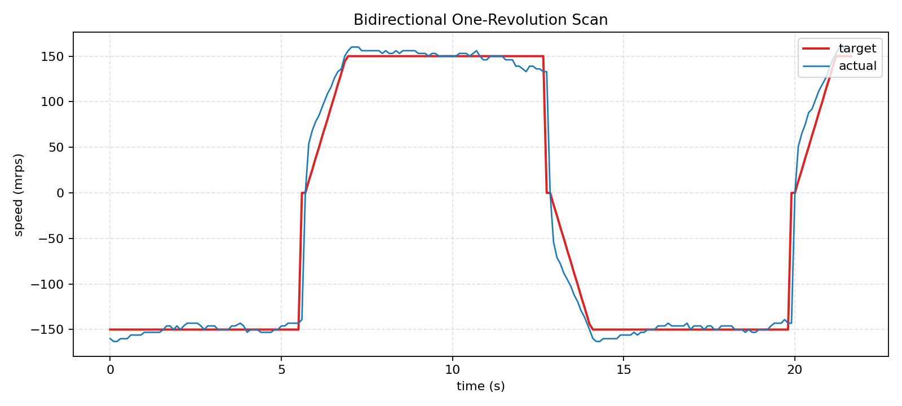
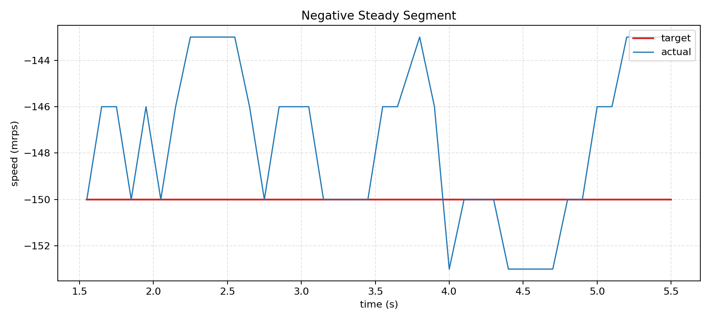
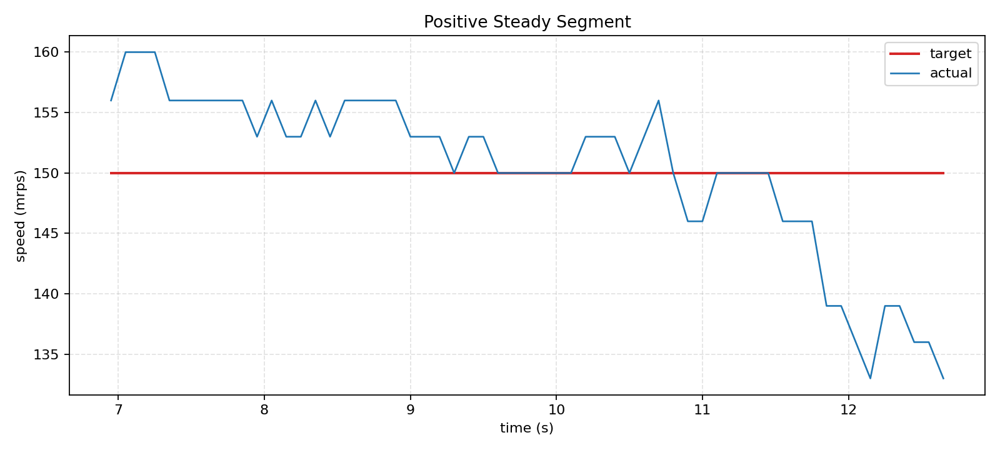
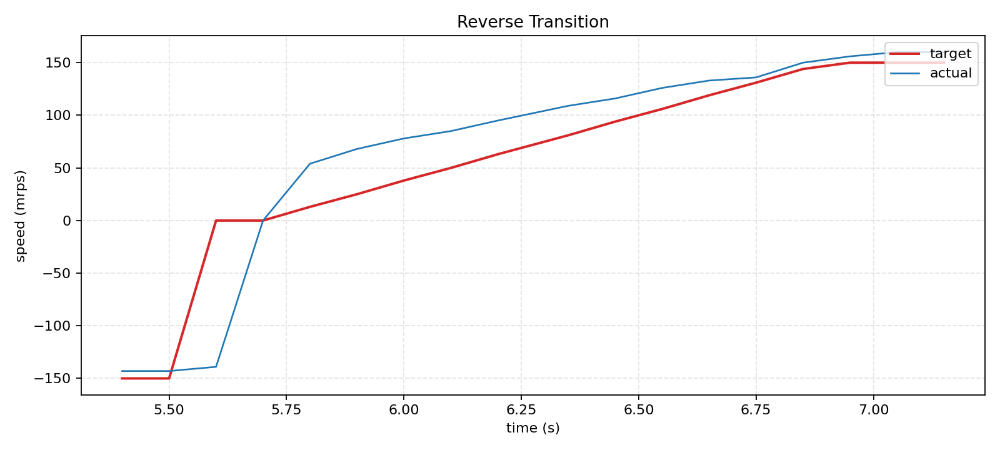

# M2 稳速验证

## 1. 目标

验证当前 M2 电机控制已经从“单向固定速度”升级为“单圈换向的双向闭环稳速”，并给出目标转速与实际转速对比证据。

## 2. 当前控制策略

当前 `MotorCtrlTask1` 采用如下策略：

- 控制周期：`50 ms`
- 单圈计数：`5880 count/rev`
- 换向周期：累计转过 `1 rev` 后触发换向
- 目标速度幅值：`0.15 rps`，即 `150 mrps`
- 换向等待阈值：`0.015 rps`
- 换向恢复斜坡：`1200 ms`
- 启动占空比：`220`
- 双向稳态基准占空比：`430`

控制流程分为三段：

1. 稳态运行：以 `+150 mrps` 或 `-150 mrps` 闭环控制
2. 到达单圈阈值：目标清零，等待实际速度衰减到阈值以下
3. 翻转方向：切换 `scan_dir`，然后按 `1200 ms` 斜坡恢复到反向目标速度

因此，本轮验证关注的不仅是“某一个方向稳不稳”，还包括：

- 正向稳态是否能锁定
- 反向稳态是否能锁定
- 换向过程是否可控

## 3. 验证数据

本轮归档日志为：

- [Bidirectional reverse log CSV](./data/m2_bidirectional_reverse_log.csv)

日志字段为：

- `tick_ms`
- `target_mrps`
- `actual_mrps`
- `error_mrps`
- `trim_pwm`
- `pwm_cmd`
- `speed_valid`

## 4. 曲线证据

### 4.1 总览

从总览图可以看到：

- 目标速度在 `+150 mrps` 与 `-150 mrps` 间周期切换
- 实际速度能跟随目标方向反复切换
- 换向时先减速到 0 附近，再进入反向恢复

### 4.2 反向稳态段

反向稳态可以看到：

- 目标约为 `-150 mrps`
- 实际速度主要围绕 `-150 mrps` 附近波动
- 没有出现持续放大振荡

### 4.3 正向稳态段

正向稳态可以看到：

- 目标约为 `+150 mrps`
- 实际速度在目标附近波动
- 在接近换向前，实际速度会出现一定下探，但仍保持闭环受控

### 4.4 换向过程

换向段可以看到：

- 先将目标速度拉回 `0`
- 等待电机实际速度降到接近 0
- 再按斜坡恢复到反向目标值

这说明当前换向过程不是“直接反打”，而是“停稳后再拉起”。

## 5. 统计结论

按当前日志中 `target = -150 mrps` 的样本统计，得到：

| 指标 | 负向稳态 |
| --- | --- |
| 样本数 | `112` |
| 实际速度均值 | `-150.16 mrps` |
| 实际速度范围 | `-163 ~ -139 mrps` |
| 误差均值 | `+0.16 mrps` |
| 最大绝对误差 | `13 mrps` |
| 速度标准差 | `5.57 mrps` |
| PWM 均值 | `-421.51` |

按当前日志中 `target = +150 mrps` 的样本统计，得到：

| 指标 | 正向稳态 |
| --- | --- |
| 样本数 | `62` |
| 实际速度均值 | `150.77 mrps` |
| 实际速度范围 | `133 ~ 160 mrps` |
| 误差均值 | `-0.77 mrps` |
| 最大绝对误差 | `17 mrps` |
| 速度标准差 | `6.83 mrps` |
| PWM 均值 | `421.39` |

说明：

- 反向稳态略紧一些
- 正向稳态在接近换向段时有更大的速度下探
- 但两侧的均值都已经锁在目标附近，没有失控或符号反转错误

## 6. 是否过关

按 M2 这一阶段的目标来看，我的判断是：**过关**。

理由是：

- 双向闭环已经建立，且方向切换逻辑有效
- 正向与反向都能在目标附近稳定
- 换向过程受控，没有出现持续发散
- 已能输出完整的 `target vs actual` 曲线与日志

当前仍然存在的工程事实是：

- 正向稳态比旧版“单方向 300 mrps”方案更松一些
- 接近换向前会出现 `10~17 mrps` 级别的偏差

这说明它还可以继续优化，但不影响把当前版本作为 M2 的“双向换向闭环控制”验收材料。

## 7. 备注

本页只负责闭环控制与稳速/换向验证，不展开误差预算。误差预算见：

- [03 Sync Error Budget](./03_角度同步误差预算.md)
