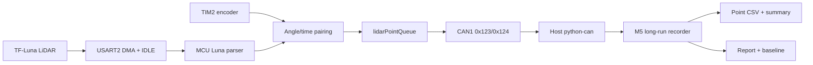
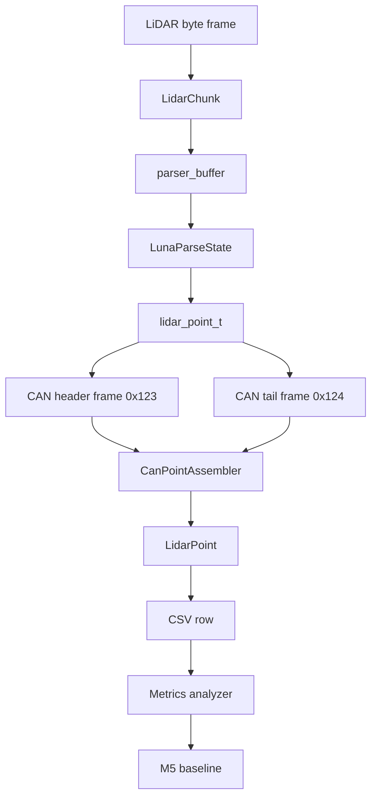
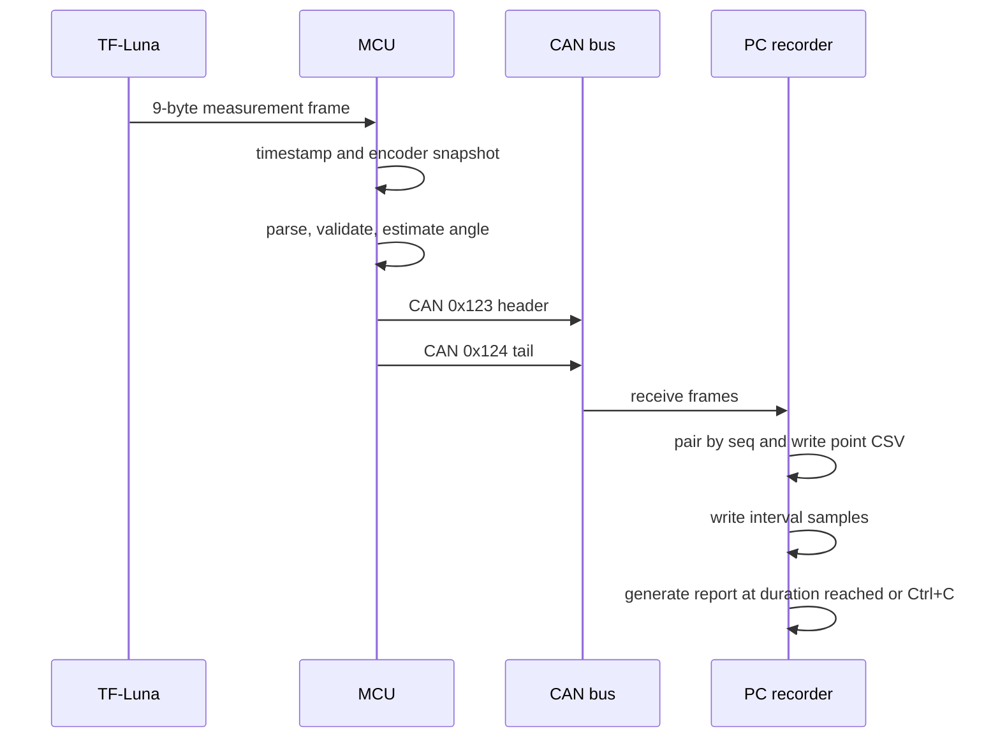
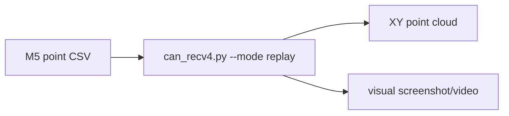

# M5 图示文档

## 1. 系统框图

```mermaid
flowchart LR
  L["TF-Luna LiDAR"] --> U["USART2 DMA + IDLE"]
  U --> P["MCU Luna parser"]
  E["TIM2 encoder"] --> A["Angle/time pairing"]
  P --> A
  A --> Q["lidarPointQueue"]
  Q --> C["CAN1 0x123/0x124"]
  C --> H["Host python-can"]
  H --> R["M5 long-run recorder"]
  R --> CSV["Point CSV + summary"]
  R --> REP["Report + baseline"]
```

## 2. 数据流图

```mermaid
flowchart TD
  B["LiDAR byte frame"] --> C["LidarChunk"]
  C --> D["parser_buffer"]
  D --> E["LunaParseState"]
  E --> F["lidar_point_t"]
  F --> G["CAN header frame 0x123"]
  F --> H["CAN tail frame 0x124"]
  G --> I["CanPointAssembler"]
  H --> I
  I --> J["LidarPoint"]
  J --> K["CSV row"]
  K --> L["Metrics analyzer"]
  L --> M["M5 baseline"]
```

## 3. 时序图

```mermaid
sequenceDiagram
  participant L as TF-Luna
  participant M as MCU
  participant C as CAN bus
  participant P as PC recorder

  L->>M: 9-byte measurement frame
  M->>M: timestamp and encoder snapshot
  M->>M: parse, validate, estimate angle
  M->>C: CAN 0x123 header
  M->>C: CAN 0x124 tail
  C->>P: receive frames
  P->>P: pair by seq and write point CSV
  P->>P: write interval samples
  P->>P: generate report at duration reached or Ctrl+C
```

## 4. 回放链路

```mermaid
flowchart LR
  CSV["M5 point CSV"] --> UI["can_recv4.py --mode replay"]
  UI --> V["XY point cloud"]
  UI --> S["visual screenshot/video"]
```
