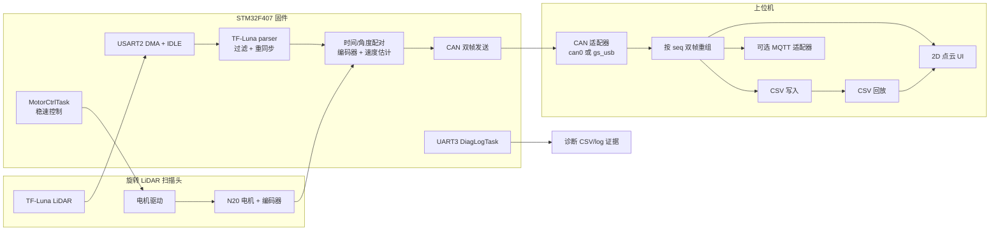
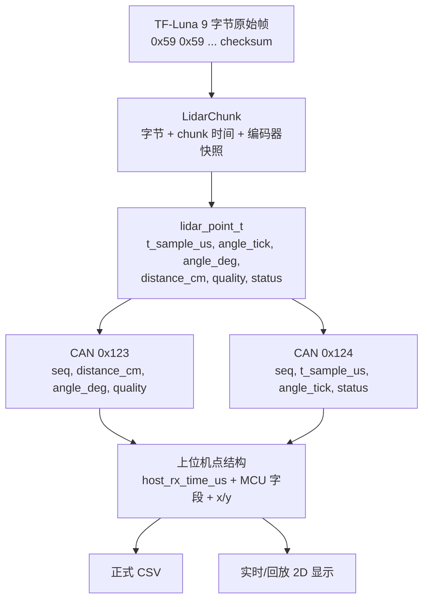
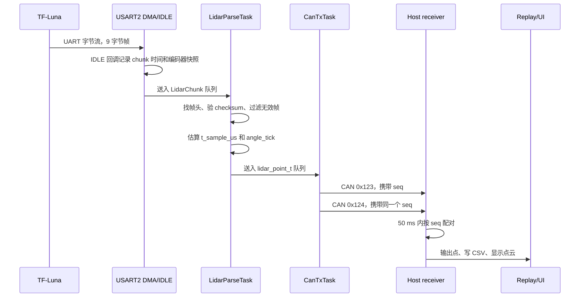

# M7 系统图示与契约表

本文集中整理 M7 交付所需的系统图、数据流图、时序图和接口表。更详细的源文档仍以 `docs/reacquaintance/`、`docs/spec_freeze/` 和各阶段 milestone 文档为准。

## 1. 系统框图



## 2. 数据流图



## 3. 时序图



## 4. CAN 报文定义表

| CAN ID | Byte 0 | Bytes 1-2 | Bytes 3-6 | Byte 7 |
| --- | --- | --- | --- | --- |
| `0x123` | `seq` | `distance_cm`，大端 | `angle_deg` float 原始位，大端 | `quality` |
| `0x124` | `seq` | `t_sample_us[31:16]`，大端 | `t_sample_us[15:0]` + `angle_tick`，大端 | `status` |

重组规则：

- 上位机按同一个 `seq` 配对 `0x123` 和 `0x124`。
- 只有两帧都到达后才输出一个完整点。
- 半帧等待超过 `50 ms` 后丢弃。
- 同一 `seq` 下同类型帧重复到达时，覆盖旧半帧并计数。
- `255 -> 0` 视为正常 `uint8_t` 回绕。
- 上位机协议层不补点、不重发、不插值。

权威详细表见 `docs/spec_freeze/03_报文表.md`。

## 5. CSV 字段表

| 字段 | 来源 | 单位 | 含义 |
| --- | --- | --- | --- |
| `host_rx_time_us` | 上位机 | us | 上位机接收并完成重组的时间 |
| `t_sample_us` | MCU | us | MCU 侧估算的点采样时间 |
| `angle_tick` | MCU | tick | 单圈内原始角度量 |
| `angle_deg` | MCU | deg | 用于显示的角度派生值 |
| `distance_cm` | MCU | cm | 已冻结的主距离字段 |
| `x_mm` | 上位机 | mm | 派生 X 坐标 |
| `y_mm` | 上位机 | mm | 派生 Y 坐标 |
| `quality` | MCU | 无 | LiDAR 强度/质量值 |
| `status` | MCU | 位标志 | 点状态；当前输出中主要表示估计路径 |

正式 CSV 表头：

```text
host_rx_time_us,t_sample_us,angle_tick,angle_deg,distance_cm,x_mm,y_mm,quality,status
```

## 6. 时间戳语义

| 字段 | 产生位置 | 是否传输 | 语义 | 边界 |
| --- | --- | --- | --- | --- |
| `t_sample_us` | MCU | 是 | 基于 UART 帧位置和 chunk 锚点估算的点时间 | 不是上位机接收时间 |
| `luna_chunk_rx_time_us` | MCU | 否 | DMA/IDLE chunk 接收锚点 | 仅内部使用 |
| `host_rx_time_us` | 上位机 | 仅 CSV | 上位机完成点重组的本地时间 | 不是 MCU 采样时间 |

这个设计刻意区分“采样时间”和“接收时间”，避免把几何计算和传输诊断混在一起。

## 7. 运行证据汇总

| 证据区域 | 当前结果 |
| --- | --- |
| M4 上位机闭环 | 实时/回放接收、CSV、2D UI 已收口 |
| M5 长稳基线 | `6116.0 s`，`612466` 点，重组丢包率 `0.001143%` |
| M6 盒子几何 | 重复性 p95 `20.00 mm`，闭合缝隙 `11.82 mm`，边缘 RMSE `16.76 mm` |
| M6 墙面几何 | 墙面直线 RMSE `7.44 mm`，残差 p95 `13.09 mm`，重复偏移 `6.31 mm` |
| M6.5 MQTT | 本地回放、Windows 上板 MQTT telemetry/cmd/status/alarm 在当前范围内通过 |

