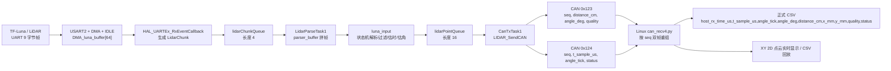

# 数据流动链路

更新时间：2026-04-20

本文只讲数据从传感器到 Linux 点云界面的流动，不展开电机闭环细节。电机细节见 [03 电机控制逻辑](./03_电机控制逻辑.md)。

## 总链路



## 1. LiDAR 到 MCU chunk

LiDAR 原始输入是 9 字节帧，帧头为 `0x59 0x59`。USART2 配成 `115200 8N1`，接收通过 DMA + IDLE 触发。

关键代码：

- `Core/Src/usart.c`：USART2 为 115200，RX DMA 是 `DMA1_Stream5`
- `Core/Src/main.c`：`HAL_UARTEx_RxEventCallback`
- `Core/Inc/main.h`：`LidarChunk`

回调里做了几件事：

1. 用 `micros_now()` 读取 MCU 微秒时间，作为 `luna_chunk_rx_time_us`。
2. 读取 TIM2 当前编码器计数 `enc16`。
3. 调用 `encoder_take_snapshot32(enc16)` 将 16 位编码器计数扩成连续 32 位计数。
4. 把 DMA buffer 中本次收到的 `Size` 字节复制进 `LidarChunk.data`。
5. 把 chunk 送入 `lidarChunkQueue`。
6. 重新启动 `HAL_UARTEx_ReceiveToIdle_DMA()`。

这一步的本质是：在 UART chunk 到达瞬间，把“数据块、时间锚点、编码器锚点”绑在一起。

## 2. Chunk 到点

`LidarParseTask1` 从 `lidarChunkQueue` 取出 chunk，把它追加到 `parser_buffer[64]`，再调用：

```c
luna_input(parser_buffer, parser_buffer_len, chunk_start_index, &local_chunk, m1_speed);
```

`luna_input()` 通过 `LunaParseState` 状态机做完整点解析：

1. `SEARCH_HEADER`：扫描 `0x59 0x59` 帧头，非帧头字节跳过并计数。
2. `VERIFY_FRAME`：用前 8 字节求和校验第 9 字节 checksum，失败时滑动 1 字节重同步并计数。
3. `DECODE_FRAME`：解析：
   - `distance_cm`
   - `amp`
   - `tmp`
4. 执行异常过滤：
   - `amp < 100` 或 `amp == 65535`：`amp_low_cnt++`，丢弃
   - `distance < 28`：`too_near_cnt++`，丢弃
5. `OUTPUT_POINT`：对成功点估算 `t_sample_us` 和 `angle_tick`。
6. 填充 `lidar_point_t` 后送入 `lidarPointQueue`。

当前异常策略是“丢弃并计数”，不是通过 `status` 把异常点继续发出去。

## 3. 时间戳回推

正式 MCU 点时间字段是 `t_sample_us`。它不是 Linux 接收时间，也不是 LiDAR 真实发光瞬间，而是 MCU 基于 UART 帧中心估计出来的点时间。

常量：

- `LUNA_FRAME_LEN = 9`
- `UART_CHAR_US = 87`
- `UART_IDLE_GUARD_US = 87`

回推逻辑：

```text
frame_end_us =
    chunk_rx_time_us
    - UART_IDLE_GUARD_US
    - bytes_after * UART_CHAR_US

t_sample_us =
    frame_end_us
    - (LUNA_FRAME_LEN * UART_CHAR_US) / 2
```

这个逻辑的意思是：从 chunk 到达时间往前扣掉 IDLE 保护时间和后续字节传输时间，得到当前帧尾时间，再减半帧时间作为帧中心。

## 4. 角度回推

角度来源是 TIM2 编码器。项目参数：

```text
ENC_PPR = 7
GEAR_RATIO = 210
4 倍频
counts_per_rev = 7 * 210 * 4 = 5880
```

当 `g_speed_valid != 0` 时，`luna_input()` 用当前电机速度从 chunk 锚点回推到点采样时刻：

```text
ticks_per_us = motor_speed_rps * counts_per_rev / 1e6
dt_us = chunk_rx_time_us - t_sample_us
backtrack_ticks = round(ticks_per_us * dt_us)
sample_count32 = chunk_encoder_count32 - backtrack_ticks
```

然后使用开机零位：

```text
angle_tick = fold_count32_to_rev(sample_count32 - g_zero_offset_count32, counts_per_rev)
angle_deg = angle_tick / counts_per_rev * 360
```

第一个成功输出点会锁定 `g_zero_offset_count32`。所以当前角度语义是“相对开机零位的真实物理单圈角度”。

## 5. 点到 CAN

`CanTxTask1` 从 `lidarPointQueue` 收点，然后调用 `LIDAR_SendCAN()`。一个点拆成两帧标准 CAN：

| CAN ID | 内容 | 说明 |
| --- | --- | --- |
| `0x123` | `seq + distance_cm + angle_deg(float bits) + quality` | 距离、角度、质量 |
| `0x124` | `seq + t_sample_us + angle_tick + status` | MCU 时间、原始角度、状态 |

两帧共用同一个 1 字节 `seq`。Linux 侧按 `seq` 配对。

注意：当前 `angle_deg` 直接以 float 原始位上 CAN，多字节字段按大端拆字节。

## 6. CAN 到 Linux CSV 和点云

Linux 入口当前是 `can_recv4.py`。它的关键逻辑：

- `FRAME_HEADER_ID = 0x123`
- `FRAME_TAIL_ID = 0x124`
- `CanPointAssembler` 按 `seq` 暂存双帧
- 50 ms 超时后淘汰缺帧
- 完成重组时生成 `host_rx_time_us`
- `CsvPointWriter` 写正式 CSV
- `compute_xy_mm()` 用 `distance_cm + angle_deg` 计算 `x_mm / y_mm`
- `PointCloudWindow` 实时显示 XY 点云，也支持 CSV 回放

正式 CSV 字段：

```text
host_rx_time_us,t_sample_us,angle_tick,angle_deg,distance_cm,x_mm,y_mm,quality,status
```

## 7. 诊断链路

诊断不是主点云链路的一部分，但它是判断链路是否稳定的依据。

`DiagLogTask1` 每秒通过 UART3 输出一行 CSV，字段包括：

- chunk 队列深度和高水位
- UART chunk 丢弃和 oversize
- parser overflow
- checksum / amp_low / too_near
- point 队列深度和高水位
- CAN 点发送成功/失败
- CAN frame 失败
- CAN last error / error IRQ / bus-off / recovery

这条链路用于 M3/M5 的可观测性和长稳验证。

## 8. 当前链路边界

- MCU 不做整圈缓存，点解析后就立即发 CAN。
- 异常 LiDAR 帧不输出点，因此 Linux 侧看不到被丢弃点，只能通过诊断计数知道。
- `host_rx_time_us` 是 Linux 重组完成时刻，不是 MCU 时间。
- `t_sample_us` 是 MCU 估算时刻，不应和 Linux 绝对时间直接相减。
- `seq` 是 1 字节，会 256 回绕；协议文档里还需要把回绕和重组规则写得更正式。
